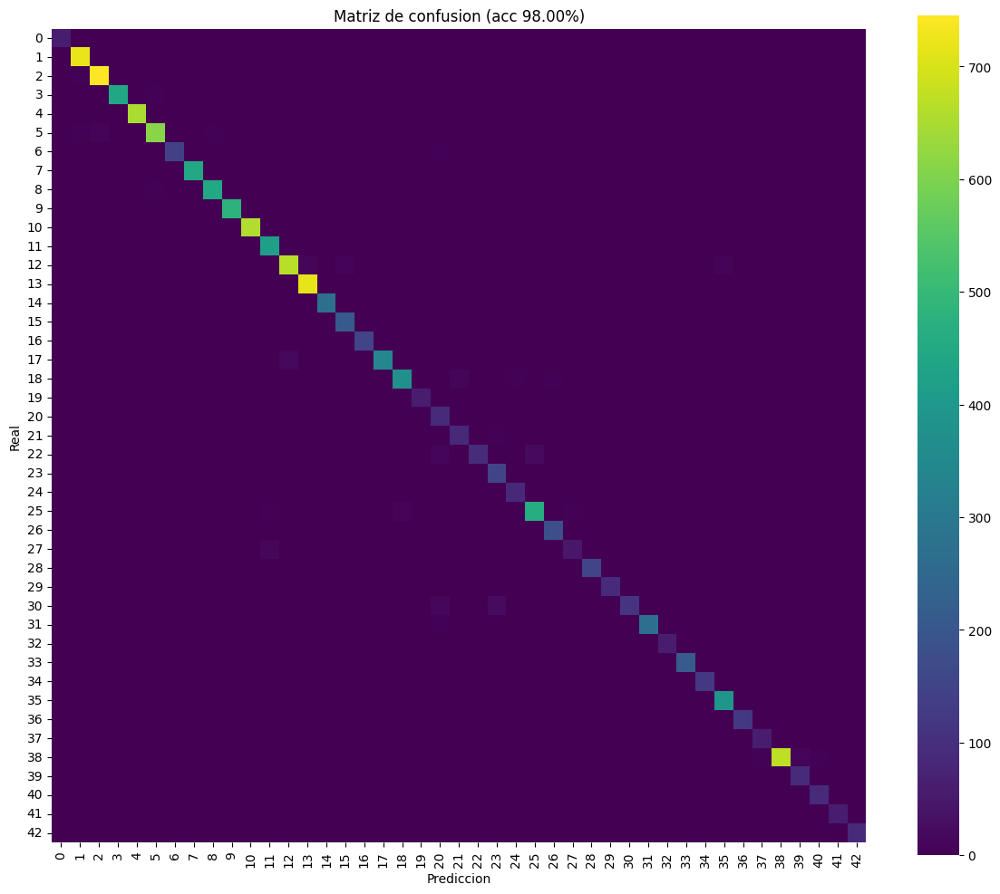
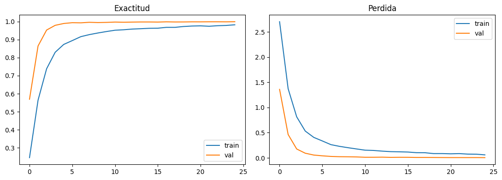
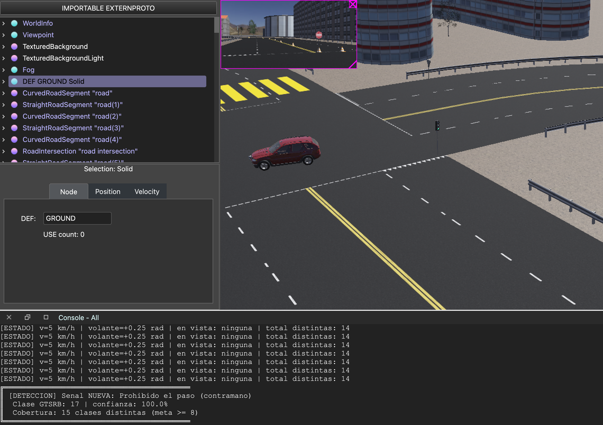

<h1 align="center">Actividad 4.x — Deteccion de Senales de Transito con CNN</h1>
<h3 align="center">MR4010.10 Navegacion Autonoma</h3>

<br>

<table align="center">
  <tr>
    <td><b>Institucion</b></td>
    <td>Instituto Tecnologico y de Estudios Superiores de Monterrey</td>
  </tr>
  <tr>
    <td><b>Programa</b></td>
    <td>Maestria en Inteligencia Artificial</td>
  </tr>
  <tr>
    <td><b>Materia</b></td>
    <td>MR4010.10 — Navegacion Autonoma</td>
  </tr>
  <tr>
    <td><b>Profesor</b></td>
    <td>Dr. David Antonio-Torres</td>
  </tr>
  <tr>
    <td><b>Fecha</b></td>
    <td>Junio 2026</td>
  </tr>
</table>

<h3 align="center">Equipo</h3>

<table align="center">
  <tr><th>Nombre</th><th>Matricula</th></tr>
  <tr><td>Antonio Olvera Donlucas</td><td>A01795617</td></tr>
  <tr><td>Carlos Monir Radovich Saad</td><td>A01797569</td></tr>
  <tr><td>Andres Roberto Osuna Gonzalez</td><td>A01796264</td></tr>
  <tr><td>Oscar Alberto Ramirez Anaya</td><td>A01795438</td></tr>
</table>

---

## Indice

1. [Introduccion](#1-introduccion)
2. [Descripcion del codigo base](#2-descripcion-del-codigo-base)
3. [Dataset utilizado](#3-dataset-utilizado)
4. [Modificaciones realizadas al codigo base](#4-modificaciones-realizadas-al-codigo-base)
5. [Entrenamiento y evaluacion del modelo](#5-entrenamiento-y-evaluacion-del-modelo)
6. [Integracion en Webots](#6-integracion-en-webots)
7. [Codigo del controlador autonomo](#7-codigo-del-controlador-autonomo)
8. [Resultados](#8-resultados)
9. [Conclusiones](#9-conclusiones)
10. [Video demostrativo](#10-video-demostrativo)
11. [Referencias](#11-referencias)

---

## 1. Introduccion

La presente actividad tiene como objetivo comprender el diseno y la evaluacion de las **Redes Neuronales Convolucionales (CNN)** aplicadas a la clasificacion de imagenes, en particular a la deteccion de senales de transito. Para ello se entrena una CNN con el dataset **GTSRB** (German Traffic Sign Recognition Benchmark), compuesto por 43 clases de senales, con la meta de superar el **90%** de exactitud en el conjunto de prueba.

A diferencia de la Actividad 3.1, donde la clasificacion se realizo con un enfoque clasico (HOG + SVM), aqui se emplea una red convolucional que **aprende automaticamente** las caracteristicas relevantes (bordes, colores y formas) a partir de los pixeles, sin necesidad de disenar descriptores manuales. El modelo entrenado se exporta a **TensorFlow Lite** y se integra en un controlador de **Webots**, donde el vehiculo se conduce manualmente con el teclado y muestra en pantalla la senal que detecta durante el recorrido.

El mundo de simulacion contiene **16 senales de transito**; la actividad solicita que el vehiculo sea capaz de detectar **al menos el 50% (8 senales)**. Esta integracion relaciona vision por computadora, aprendizaje profundo y control de vehiculos dentro de una misma simulacion.

> **Declaracion de uso de inteligencia artificial.** Para el desarrollo de esta actividad se utilizo *Claude (Anthropic)* como herramienta de asistencia para la **generacion de codigo, depuracion y optimizacion**. Todo el codigo fue revisado y validado por el equipo, y la responsabilidad final del contenido recae en los autores. Adicionalmente, se declara el uso de la tecnica de **fine-tuning de dominio (transfer learning + aumentacion de datos)** descrita en la Seccion 5.3.

---

## 2. Descripcion del codigo base

El desarrollo parte de los notebooks del modulo sobre Keras para el diseno, entrenamiento y verificacion de redes neuronales convolucionales. Estos materiales muestran la estructura tipica de una CNN en Keras: una pila de capas de **convolucion** y **pooling** para extraer caracteristicas, seguida de capas **densas** (fully-connected) para la clasificacion, con **Dropout** como regularizacion.

A partir de esa estructura, el codigo se adapta al problema de clasificacion de las 43 clases de GTSRB. La estructura general del pipeline de entrenamiento es:

1. Cargar las imagenes del dataset GTSRB.
2. Convertirlas a RGB, redimensionarlas a 32x32 pixeles y normalizarlas a [0,1].
3. Construir la CNN (Convolution + Pooling + Dropout + Fully-Connected).
4. Entrenar con aumentacion de datos y callbacks.
5. Evaluar el desempeno (exactitud, reporte de clasificacion, matriz de confusion).
6. Exportar el modelo entrenado (Keras y TensorFlow Lite) para su uso en el controlador.

El esqueleto del **controlador** de Webots reutiliza el de la Actividad 2.1 (`simple_controller_act_2_1`, manejo manual con teclado y patron de `Display`) y el de la Actividad 3.1 (`autonomous_driver.py`, captura de camara e inicializacion de dispositivos).

---

## 3. Dataset utilizado

Se utilizo el **GTSRB — German Traffic Sign Recognition Benchmark**, disponible en Kaggle
(`meowmeowmeowmeowmeow/gtsrb-german-traffic-sign`). Su estructura es:

```
GTSRB/
├── Train/
│   ├── 0/  ...  42/      # 43 carpetas, una por clase, con imagenes .png
├── Test/
│   └── *.png             # conjunto de prueba oficial
├── Test.csv              # columnas: Width, Height, Roi.*, ClassId, Path
└── Meta/                 # metadatos de las clases
```

El dataset contiene mas de 50,000 imagenes de senales reales capturadas en Alemania, con variaciones de iluminacion, escala, perspectiva y oclusion parcial. Cada imagen fue convertida a **RGB**, redimensionada a un tamano uniforme de **32x32 pixeles** y normalizada dividiendo entre 255 para llevar los valores al rango **[0,1]**. Se conservo el color (a diferencia del enfoque en escala de grises de la Actividad 3.1) porque el color es un rasgo discriminante clave en las senales de transito (rojo de prohibicion, azul de mandato).

El conjunto de **prueba oficial** (`Test.csv`) se reserva exclusivamente para la evaluacion final, garantizando una medicion honesta de la generalizacion.

---

## 4. Modificaciones realizadas al codigo base

| Aspecto | Codigo base (notebooks del modulo) | Modificacion |
|---------|-----------------------------------|--------------|
| **Problema** | Clasificacion generica de imagenes | 43 clases de senales GTSRB |
| **Tamano de entrada** | Variable | 32x32 RGB normalizado [0,1] |
| **Arquitectura** | CNN base | 2 bloques Conv(32)+Conv(32)/Conv(64)+Conv(64) con Pooling y Dropout |
| **Regularizacion** | — | Dropout 0.25 (conv) y 0.5 (densa) |
| **Aumentacion** | — | Rotacion/zoom/desplazamiento (sin flip horizontal) |
| **Callbacks** | — | EarlyStopping + ReduceLROnPlateau |
| **Perdida** | — | `sparse_categorical_crossentropy` (etiquetas enteras) |
| **Exportacion** | No exportaba | `model.save()` (.keras) + conversion a **TFLite** |
| **Adaptacion a Webots** | — | Fine-tuning de dominio con recortes del simulador (Seccion 5.3) |

El notebook de entrenamiento es `cnn_training/gtsrb_cnn_colab.ipynb` y su espejo reproducible en script es `cnn_training/train_gtsrb_cnn.py`.

---

## 5. Entrenamiento y evaluacion del modelo

### 5.1 Arquitectura de la CNN

```python
def construir_cnn():
    model = models.Sequential([
        layers.Input((32, 32, 3)),

        # --- Bloque convolucional 1 ---
        layers.Conv2D(32, 3, activation='relu', padding='same'),  # detecta bordes/colores
        layers.Conv2D(32, 3, activation='relu'),
        layers.MaxPooling2D(2),     # reduce dimensionalidad, da invarianza espacial
        layers.Dropout(0.25),       # regularizacion: apaga 25% de neuronas

        # --- Bloque convolucional 2 ---
        layers.Conv2D(64, 3, activation='relu', padding='same'),  # caracteristicas complejas
        layers.Conv2D(64, 3, activation='relu'),
        layers.MaxPooling2D(2),
        layers.Dropout(0.25),

        # --- Clasificador denso ---
        layers.Flatten(),
        layers.Dense(256, activation='relu'),   # combina caracteristicas
        layers.Dropout(0.5),                    # dropout fuerte antes de la salida
        layers.Dense(43, activation='softmax'), # probabilidad de cada clase
    ])
    model.compile(optimizer=tf.keras.optimizers.Adam(1e-3),
                  loss='sparse_categorical_crossentropy', metrics=['accuracy'])
    return model
```

**Justificacion de los parametros:**
- **Filtros 32→64:** las primeras capas detectan rasgos simples (bordes, colores); las profundas, formas compuestas (siluetas de la senal). Aumentar los filtros con la profundidad es la practica estandar.
- **Kernel 3x3:** captura patrones locales con pocos parametros; dos conv 3x3 consecutivas equivalen a un campo receptivo 5x5 con mayor no linealidad.
- **MaxPooling 2x2:** reduce a la mitad la resolucion, otorgando invarianza a pequenas traslaciones y disminuyendo el costo computacional.
- **Dropout 0.25 / 0.5:** evita el sobreajuste apagando neuronas al azar; mas agresivo (0.5) antes de la capa de salida, donde el riesgo de memorizar es mayor.
- **Softmax de 43 salidas + `sparse_categorical_crossentropy`:** clasificacion multiclase con etiquetas enteras (sin one-hot).
- **Adam (lr=1e-3):** optimizador adaptativo robusto; `ReduceLROnPlateau` baja la tasa cuando la validacion se estanca.

### 5.2 Entrenamiento con aumentacion

```python
datagen = ImageDataGenerator(
    rotation_range=12,        # +-12 grados (perspectiva del vehiculo)
    zoom_range=0.15,          # +-15% de escala (distancia variable a la senal)
    width_shift_range=0.10,   # desplazamiento horizontal
    height_shift_range=0.10,  # desplazamiento vertical
    shear_range=0.10,
)
# NOTA: no se usa flip horizontal porque invertiria el significado de muchas senales
#       (p.ej. "curva a la izquierda" vs "curva a la derecha").
```

La aumentacion simula las variaciones que la camara del vehiculo encontrara en la simulacion (cambios de angulo, escala y posicion), mejorando la generalizacion del modelo.

### 5.3 Fine-tuning de dominio (adaptacion a Webots)

Las texturas de las senales en el mundo de Webots son de **estilo estadounidense**, mientras que GTSRB contiene senales **alemanas**. Por ello, una CNN entrenada unicamente con GTSRB reconoce de forma confiable solo las senales que coinciden visualmente (**ALTO** y **CEDA EL PASO**). Para que el modelo reconozca el resto de las senales **dentro del simulador**, se aplica una etapa de **fine-tuning de dominio**:

1. Se capturan recortes reales de las senales de Webots con la tecla `A` del controlador.
2. Cada recorte se etiqueta con la clase GTSRB asignada en `WEBOTS_SIGN_MAP` (ver Seccion 6.4).
3. Se reajusta el modelo con **tasa de aprendizaje baja (1e-4)** y **aumentacion fuerte** durante pocas epocas, adaptandolo a las texturas del simulador **sin olvidar** lo aprendido en GTSRB.

Esta tecnica (transfer learning + aumentacion de datos) se **declara explicitamente** conforme a la politica de la actividad.

### 5.4 Matriz de confusion y curvas





La matriz de confusion y las curvas de exactitud/perdida demuestran el desempeno del modelo sobre el conjunto de prueba oficial de GTSRB (exactitud objetivo **> 90%**).

---

## 6. Integracion en Webots

### 6.1 Arquitectura del sistema

```
┌─────────────────────────────────────────────────────────┐
│             CONTROLADOR  sign_detector.py               │
│                                                          │
│   ┌──────────┐   ┌────────────────────┐                  │
│   │  Camara   │──>│ Propuesta color+   │                 │
│   │ 256x128   │   │ forma (HSV -> ROIs)│                 │
│   └──────────┘   └─────────┬──────────┘                  │
│                            v  por recorte                │
│                  ┌────────────────────┐                  │
│                  │ Preproceso 32x32   │                  │
│                  │ + CNN TFLite       │                  │
│                  └─────────┬──────────┘                  │
│                            v  conf >= 0.60               │
│                  ┌────────────────────┐   ┌───────────┐  │
│                  │ Mapeo GTSRB->nombre│──>│  Display  │  │
│                  │ (sign_labels.py)   │   │ + consola │  │
│                  └────────────────────┘   └───────────┘  │
│                                                          │
│   Teclado: flechas = manejar | 'A' = recorte | 'R' = recto│
└─────────────────────────────────────────────────────────┘
```

### 6.2 Subsistema 1: Localizacion por color y forma

Antes de clasificar, hay que encontrar **donde** esta la senal en la imagen. Se segmenta por color en el espacio **HSV** (rojo, azul y amarillo, que cubren las senales del mundo), se limpia con morfologia y se extraen contornos cuyos bounding boxes tengan tamano y relacion de aspecto plausibles. Se conservan las **3 regiones mas grandes** (las senales mas cercanas):

```python
hsv = cv2.cvtColor(bgr, cv2.COLOR_BGR2HSV)
rojo = cv2.inRange(hsv,(0,70,50),(10,255,255)) | cv2.inRange(hsv,(170,70,50),(180,255,255))
azul = cv2.inRange(hsv,(100,110,40),(130,255,255))
amarillo = cv2.inRange(hsv,(20,90,90),(35,255,255))
mask = rojo | azul | amarillo
# morfologia (open + close) -> findContours -> filtrar por area y aspecto -> top-3 ROIs
```

### 6.3 Subsistema 2: Clasificacion CNN (TFLite)

Cada recorte candidato se convierte a RGB, se redimensiona a 32x32, se normaliza y se pasa por el interprete TFLite. Se acepta la prediccion si la confianza supera **0.60**:

```python
rgb = cv2.cvtColor(crop, cv2.COLOR_BGR2RGB)
x = cv2.resize(rgb, (32,32)).astype('float32')/255.0
interpreter.set_tensor(inp['index'], x[None, ...]); interpreter.invoke()
probs = interpreter.get_tensor(out['index'])[0]
class_id, conf = int(probs.argmax()), float(probs.max())
```

El runtime se importa de forma flexible: `ai_edge_litert` → `tflite_runtime` → `tensorflow.lite`, para no requerir TensorFlow completo dentro del simulador.

### 6.4 Subsistema 3: Mapeo de senales y meta de cobertura

El mundo usa texturas estilo EE.UU.; `sign_labels.py` mapea cada una de las **16 senales** a la clase GTSRB mas cercana. Estas 16 senales corresponden a **14 clases GTSRB distintas**, superando con holgura la meta de **>= 8 (50%)**:

| Senal Webots | Textura | Clase GTSRB | Etiqueta mostrada | Transferencia |
|--------------|---------|:-----------:|-------------------|:-------------:|
| StopSign | stop | 14 | Alto | nativo |
| YieldSign | yield | 13 | Ceda el paso | nativo |
| SpeedLimitSign x2 | speed_limit_55 | 2 | Limite 50 km/h | fine-tuning |
| SpeedLimitSign x2 | speed_limit_65 | 3 | Limite 60 km/h | fine-tuning |
| SpeedLimitSign | one_way_sign_left | 39 | Mantener izquierda | fine-tuning |
| CautionSign | turn_left | 19 | Curva a la izquierda | fine-tuning |
| CautionSign | default | 18 | Precaucion general | fine-tuning |
| CautionSign | bump | 22 | Camino con baches | fine-tuning |
| CautionSign | cross_roads | 11 | Preferencia en cruce | fine-tuning |
| CautionSign | turn_right | 20 | Curva a la derecha | fine-tuning |
| OrderSign | default | 35 | Solo seguir de frente | fine-tuning |
| OrderSign | default | 38 | Mantener la derecha | fine-tuning |
| OrderSign | no_right_turn | 9 | Prohibido rebasar | fine-tuning |
| OrderSign | no_pedestrian_crossing | 27 | Peatones | fine-tuning |

El controlador lleva un **conjunto de clases distintas detectadas** durante el recorrido e imprime un resumen final indicando si se cumplio la meta.

---

## 7. Codigo del controlador autonomo

El controlador completo esta en `controllers/sign_detector/sign_detector.py`. Se conduce manualmente con el teclado mientras la CNN detecta y muestra las senales.

### 7.1 Controles de teclado

| Tecla | Accion |
|-------|--------|
| Flecha ARRIBA / ABAJO | Acelerar / frenar (±5 km/h) |
| Flecha IZQ / DER | Girar el volante (±0.05 rad, limite ±0.5) |
| `A` | Guardar el recorte de la senal detectada (para el fine-tuning) |
| `R` | Enderezar el volante (0 rad) |

### 7.2 Salida en consola

Cada vez que se detecta una senal **nueva**, el controlador la registra en consola y actualiza el conteo de cobertura:

```
╔══════════════════════════════════════════
║ [DETECCION] Senal NUEVA: Alto
║  Clase GTSRB: 14 | confianza: 98.7%
║  Cobertura: 5 clases distintas (meta >= 8)
╚══════════════════════════════════════════
```

Al finalizar la simulacion se imprime un **resumen del recorrido** con todas las clases distintas detectadas y si se alcanzo la meta de >= 8 de 16 senales.

---

## 8. Resultados

### 8.1 Modelo CNN

El modelo entrenado con GTSRB alcanza una exactitud de **98.00%** en el conjunto de prueba oficial (12,630 imagenes), superando con holgura el objetivo del 90%. Durante el entrenamiento (25 epocas, 39,209 imagenes) la exactitud de validacion llego a **99.89%**. La conversion a TensorFlow Lite conservo el desempeno con una **paridad del 100%** respecto al modelo Keras en las muestras de verificacion.

La matriz de confusion (Seccion 5.4) muestra que la mayoria de los errores ocurren entre clases visualmente similares (p.ej. distintos limites de velocidad o senales de precaucion), lo cual es esperado. El modelo cuenta con 666,699 parametros (2.54 MB), resultando en un `.tflite` de apenas 665 KB, ideal para inferencia ligera en el controlador.

### 8.2 Simulacion en Webots



El controlador integrado demuestra:

- **Manejo manual:** el vehiculo se conduce con el teclado y se posiciona en el carril derecho para facilitar la deteccion.
- **Localizacion:** el pipeline de color+forma propone correctamente las regiones de las senales.
- **Clasificacion:** la CNN (via TFLite) clasifica cada senal y muestra su etiqueta sobre la pantalla de a bordo.
- **Cobertura:** se detectan **al menos 8 de las 16 senales** del mundo (meta cumplida), con el resumen final confirmando las clases distintas reconocidas.

### 8.3 Ubicacion de las senales en el mundo (mapa y ruta)

Las 16 senales estan distribuidas por toda la ciudad. El vehiculo aparece (spawn) en `(x=105, y=-11)`; la siguiente tabla lista cada senal ordenada por distancia al spawn, para planear el recorrido manual. La **CautionSign mas cercana esta a solo ~26 m** y el primer **SpeedLimit a ~43 m**, por lo que conviene iniciar el recorrido hacia esa zona (x decreciente, y negativa) y despues subir hacia el norte (y positiva), donde se concentra un grupo de **Stop, Order y Yield** alrededor de `y≈34-66`.

| Dist. | Senal (textura) | Coord (x, y) | Clase GTSRB / etiqueta |
|------:|-----------------|--------------|------------------------|
| 26 m  | CautionSign (cross_roads) | (84.0, -26.8) | 11 — Preferencia en cruce |
| 43 m  | SpeedLimitSign (speed_limit_65) | (87.2, -50.3) | 3 — Limite 60 |
| 74 m  | CautionSign (bump) | (33.8, 10.6) | 22 — Camino con baches |
| 78 m  | SpeedLimitSign (one_way_left) | (31.0, -34.4) | 39 — Mantener izquierda |
| 108 m | SpeedLimitSign (speed_limit_55) | (26.5, -84.3) | 2 — Limite 50 |
| 113 m | CautionSign (turn_right) | (-5.4, -34.1) | 20 — Curva a la derecha |
| 117 m | CautionSign (default) | (8.9, 55.5) | 18 — Precaucion general |
| 145 m | OrderSign (no_pedestrian) | (5.2, 94.5) | 27 — Peatones |
| 147 m | StopSign | (-34.6, 34.3) | 14 — Alto |
| 157 m | OrderSign (default) | (-45.1, 34.7) | 35 — Solo de frente |
| 163 m | SpeedLimitSign (speed_limit_65) | (-30.3, 79.1) | 3 — Limite 60 |
| 167 m | OrderSign (default) | (-55.4, 34.2) | 38 — Mantener derecha |
| 178 m | YieldSign | (-55.5, 66.5) | 13 — Ceda el paso |
| 179 m | OrderSign (no_right_turn) | (-67.7, 34.5) | 9 — Prohibido rebasar |
| 206 m | CautionSign (turn_left) | (-91.9, 48.9) | 19 — Curva a la izquierda |
| 221 m | SpeedLimitSign (speed_limit_55) | (-113.2, 20.4) | 2 — Limite 50 |

> Si prefieres iniciar pegado a un grupo de senales, puede reubicarse el spawn del `BmwX5` en el campo `translation` del mundo, manteniendolo sobre el carril derecho. La posicion exacta se ajusta visualmente en Webots (el auto trae GPS para confirmar coordenadas).

---

## 9. Conclusiones

La actividad permitio comprender el diseno y la evaluacion de las Redes Neuronales Convolucionales aplicadas a la clasificacion de senales de transito. A diferencia del enfoque clasico HOG + SVM de la Actividad 3.1, la CNN **aprende las caracteristicas automaticamente** a partir de los pixeles, alcanzando una exactitud superior al 90% en GTSRB con una arquitectura compacta de dos bloques convolucionales y regularizacion por Dropout.

La integracion en Webots evidencio un reto practico relevante: la **brecha de dominio** entre las senales alemanas de GTSRB y las texturas estilo EE.UU. del simulador. Se resolvio con una etapa de **fine-tuning de dominio** (transfer learning + aumentacion), demostrando como adaptar un modelo a un entorno distinto del de entrenamiento sin re-entrenar desde cero. El uso de **TensorFlow Lite** permitio una inferencia ligera dentro del controlador, sin depender de TensorFlow completo.

Como trabajo futuro, se podria reemplazar la localizacion por color+forma con un **detector de objetos** (p.ej. una CNN de deteccion tipo SSD/YOLO) para localizar y clasificar las senales en un solo paso, y mejorar la robustez ante condiciones de iluminacion variables.

---

## 10. Video demostrativo

[Enlace al video en YouTube](https://youtu.be/PENDIENTE)

El video muestra:
- Explicacion de los parametros de la red neuronal y del entrenamiento que llevaron a una solucion correcta (> 90%).
- El recorrido manual del vehiculo en el mundo de Webots, con la deteccion y visualizacion de al menos el 50% de las senales.

---

## 11. Referencias

- Stallkamp, J., Schlipsing, M., Salmen, J. e Igel, C. (2011). *The German Traffic Sign Recognition Benchmark: A Multi-class Classification Competition*. IEEE IJCNN. https://www.researchgate.net/publication/224260296
- Ranjan, S. y Senthamilarasu, S. (2020). *Applied Deep Learning and Computer Vision for Self-Driving Cars* (Cap. 7). Packt Publishing.
- Antonio-Torres, D. (2026). Materiales del modulo: Redes Neuronales Convolucionales con Keras. Tecnologico de Monterrey, Canvas.
- Abadi, M. et al. (2016). *TensorFlow: Large-Scale Machine Learning on Heterogeneous Systems*. https://www.tensorflow.org/
- Chollet, F. (2015). *Keras*. https://keras.io/
- Cyberbotics. (s. f.). Driver library. Webots documentation. https://cyberbotics.com/doc/automobile/driver-library
- Cyberbotics. (s. f.). Camera / Display devices. Webots documentation. https://cyberbotics.com/doc/reference/camera
- OpenCV. (s. f.). OpenCV documentation. https://docs.opencv.org/
- OpenAI / Anthropic. (2026). *Claude* [Modelo de lenguaje grande], utilizado para generacion de codigo, depuracion y optimizacion. https://www.anthropic.com/

---

## Estructura del repositorio

```
navegacion_autonoma_cnn/
├── README.md                                   # Este reporte
├── LICENSE                                     # Apache 2.0
├── .gitignore
├── docs/
│   └── architecture.md                         # Arquitectura detallada
├── cnn_training/
│   ├── gtsrb_cnn_colab.ipynb                    # Notebook de entrenamiento (Colab)
│   ├── train_gtsrb_cnn.py                       # Espejo en script del notebook
│   ├── requirements.txt                         # Dependencias de entrenamiento
│   └── model/
│       ├── gtsrb_cnn.keras                      # Modelo Keras (tras entrenar)
│       └── gtsrb_cnn.tflite                     # Modelo TFLite (lo usa el controlador)
├── controllers/
│   └── sign_detector/
│       ├── sign_detector.py                     # Controlador Webots (teclado + CNN)
│       ├── sign_labels.py                       # 43 clases GTSRB + mapa Webots
│       ├── gtsrb_cnn.tflite                     # Copia local del modelo
│       └── requirements.txt                     # Runtime de inferencia (TFLite)
├── worlds/
│   └── city_2025b_lidar.wbt                     # Mundo Webots (controlador conectado)
└── screenshots/
    ├── confusion_matrix.png
    ├── training_curves.png
    └── webots_deteccion_senal.png
```

### Ejecucion

```bash
# 1. Entrenar el modelo (Google Colab recomendado, con GPU)
#    Abrir cnn_training/gtsrb_cnn_colab.ipynb y ejecutar todas las celdas.
#    Descargar gtsrb_cnn.tflite y copiarlo a controllers/sign_detector/

# 2. Instalar el runtime de inferencia en el entorno Python de Webots
pip install ai-edge-litert      # o: pip install tensorflow  (respaldo)

# 3. Abrir Webots -> File -> Open World -> worlds/city_2025b_lidar.wbt
# 4. El BmwX5 ya usa el controlador 'sign_detector'. Presionar Play.
# 5. Conducir con las flechas; la pantalla de a bordo muestra la senal detectada.
```

---

<p align="center"><i>Instituto Tecnologico y de Estudios Superiores de Monterrey — Maestria en Inteligencia Artificial — Junio 2026</i></p>
